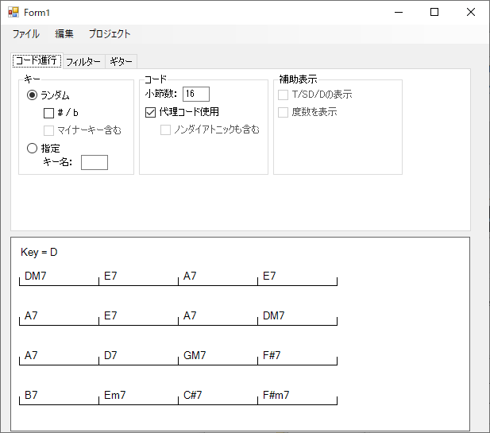

Guitar Trainer
===================================

# Overview

ギターの練習用に、指定したキー・小説数でコード進行を自動生成します。

フィルターを適用することで以下のようなことも意識してコード進行を生成可能にする予定です。

* 状況に応じ、ベースラインが半音でつながるようにする
* 状況に応じ、トップノートが固定されるようにする
* 特定のコードをII-Vに変換する

## Licence

[MIT](https://github.com/tri-star/docker-prometheus-exporter/blob/master/LICENSE)

## Author

[tri-star](https://github.com/tri-star)
